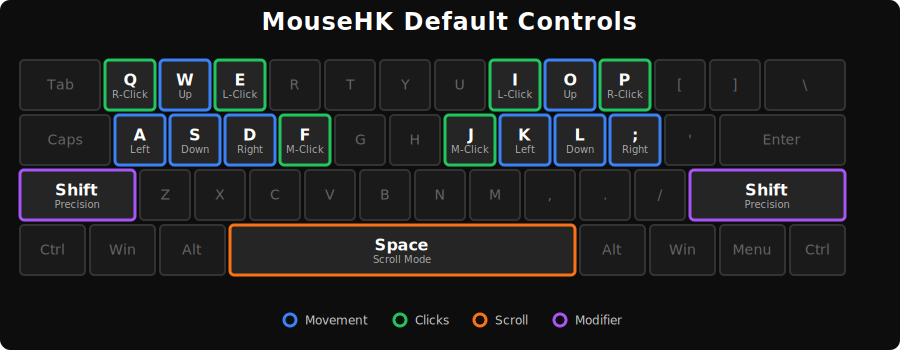

# 🖱️ MouseHK (v1.2)

**Transform your keyboard into a high-precision mouse.**

MouseHK allows you to control your cursor, click, scroll, and drag without ever lifting your hands from the home row. Designed for power users, developers, and ergonomic enthusiasts who want to minimize hand movement and maximize efficiency.

---

## 🌟 Why MouseHK?

*   **⚡ Speed & Flow:** Keep your hands on the keyboard. No more reaching for the mouse.
*   **🎯 Precision & Acceleration:** Features dynamic acceleration for fast travel across screens, and a "Sniper Mode" for pixel-perfect adjustments.
*   **🙌 Customizable Controls:** Fully configurable via `MouseHK.ini`.
*   **🛡️ Smart Typing Protection:** Automatically disables letter keys when active to prevent accidental typing, but lets system shortcuts (`Ctrl+C`, `Alt+Tab`) pass through.
*   **🔌 Modifier Support:** Fully supports `Ctrl`, `Alt`, `Shift`, and `Win` modifiers. Perform `Ctrl + Click` or `Shift + Drag` naturally.

---

MouseHK is designed to be highly configurable.

### 1. `MouseHK.ini` (Primary Configuration)
This is the main way to customize the script. Open `MouseHK.ini` in any text editor (Notepad, VS Code) to change keys, speeds, and behavior.

**Options:**
*   **SuppressKeys:** `1` to block typing when active, `0` to allow it.
*   **StartActive:** `1` to start the script Active, `0` to start Suspended.
**Key Format:**
*   **Single Key:** `Up=w`
*   **Multiple Keys:** Use the pipe `|` separator. `Up=w | Up` (Moves with W or Arrow Up).
*   **Modifiers:** Use standard names like `Ctrl`, `Shift`, `Alt`, `Win`. `ToggleMouse=Ctrl + Shift + M`.
*   **Lock Triggers:** Use `CapsLock`, `NumLock`, or `ScrollLock` followed by `ON` or `OFF`.
    *   *Example:* `ToggleMouse=CapsLock OFF` (Script Active when CapsLock is OFF).
    *   *Example:* `ToggleMouse=NumLock ON` (Script Active when NumLock is ON).
    *   **Note:** If you use a Lock Key as a toggle, the script will automatically synchronize the key's state (LED) with the script's state. For example, if you set `ToggleMouse=CapsLock OFF`, activating the script will turn CapsLock OFF, and suspending it will turn CapsLock ON.

#### 🧠 Understanding Behavior Modifiers
"Behavior Modifiers" are special keys that change *how* the mouse works while you hold them down. Unlike standard modifiers (like Ctrl/Alt), these trigger specific modes in MouseHK:

*   **PrecisionMode (`Shift`):** While held, the cursor moves much slower for precise work (like editing photos or selecting text).
*   **ScrollMode (`Space`):** While held, your movement keys (WASD/IJKL) turn into scroll wheels.
    *   *Example:* Hold `Space` + Press `W` = Scroll Up.
*   **ClickHolder (`Shift`):** While held, clicking a mouse button toggles it "stuck" down (for dragging).
    *   *Example:* Hold `Shift` + Click `Left` = Left Button Held Down (Drag). Click again to release.

> **Note:** You can change these keys in the `[BehaviorModifiers]` section of the INI file.

### 2. Script Defaults (Backup)
If `MouseHK.ini` is deleted or lost, the script automatically falls back to internal default values to ensure you never lose control.

> **Tip:** Always keep `MouseHK.ini` next to the script for your custom settings to apply.

---

## 🎮 Controls Guide

## 🎮 Features

### 📍 Movement & Clicks
Move the cursor and perform clicks using your configured keys. The script supports acceleration, meaning the cursor starts slow for precision and speeds up for travel.

### 📜 Scrolling
Hold the **Scroll Mode** key and use your movement keys to scroll web pages and documents.

### 🎯 Precision Mode
Hold the **Precision Mode** key to drastically slow down the cursor for pixel-perfect work (e.g., selecting text, photo editing).

### ✊ Drag & Drop (Click Holder)
Press the **Click Holder** key to toggle the left mouse button DOWN. Move the cursor to drag an item, then press it again to release (UP).

---

## 📝 Changelog

### v1.2 - Zero Lag Edition (by LukaV18)
*   **New Engine:** **Kernel Injection**: Replaced `MouseMove` with `DllCall("mouse_event")` for zero-latency cursor movement.
*   **New Feature:** **Delta Time Scrolling**: Scrolling speed now adjusts dynamically based on frame time, ensuring silky smooth scrolling regardless of system load.
*   **Optimization:** **Zero Lag**: Significant reduction in input latency and CPU usage.

### v1.1 - Enhanced Control
*   **New:** **Lock Key Triggers**: Toggle the script automatically based on `CapsLock`, `NumLock`, or `ScrollLock` state (e.g., `ToggleMouse=CapsLock OFF`).
*   **New:** **Modifier Support**: Full support for `Ctrl`, `Alt`, `Win` modifiers with clicks and movement.
*   **New:** **Button 4/5 Support**: Optional configuration for Back (`Button4`) and Forward (`Button5`) mouse buttons.
*   **New:** **StartActive**: Option in INI to choose if the script starts enabled or disabled.
*   **Improved:** Script no longer suspends when modifiers are held, allowing for seamless integration with system shortcuts.
*   **Fix:** **Invalid Key Crash**: Script now gracefully handles invalid key names in configuration instead of crashing.

### v1.0 - Initial Release
*   **Core:** Full keyboard mouse emulation with dynamic acceleration.
*   **Config:** Robust `MouseHK.ini` configuration system.
*   **Backup:** Internal WASD defaults for fail-safe operation.
*   **Features:** Precision Mode, Scroll Mode, Drag-Lock (ClickHolder).
*   **Safety:** Smart key suppression to prevent accidental typing.

---
## 🤖 About the Development

This project was created by **Tomflame** with the assistance of **[Google Antigravity](https://antigravity.google/)**, an advanced agentic AI coding assistant designed by the Google Deepmind team.

