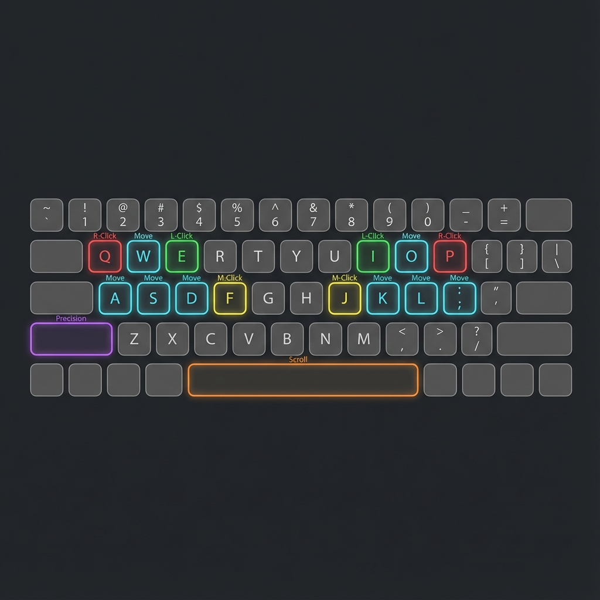

# 🖱️ MouseHK (v1.0)

**Transform your keyboard into a high-precision mouse.**

MouseHK allows you to control your cursor, click, scroll, and drag without ever lifting your hands from the home row. Designed for power users, developers, and ergonomic enthusiasts who want to minimize hand movement and maximize efficiency.

---

## 🌟 Why MouseHK?

*   **⚡ Speed & Flow:** Keep your hands on the keyboard. No more reaching for the mouse.
*   **🎯 Precision & Acceleration:** Features dynamic acceleration for fast travel across screens, and a "Sniper Mode" for pixel-perfect adjustments.
*   **🙌 Customizable Controls:** Fully configurable via `MouseHK.ini`.
*   **🛡️ Smart Typing Protection:** Automatically disables letter keys when active to prevent accidental typing, but lets system shortcuts (`Ctrl+C`, `Alt+Tab`) pass through.

---

## 📥 Quick Start

1.  **Install:** Download and install [AutoHotkey v2](https://www.autohotkey.com/).
2.  **Download:** Get the latest `MouseHK.ahk` script and `MouseHK.ini`.
3.  **Run:** Double-click `MouseHK.ahk`.
4.  **Toggle:** Press **`Shift + Space`** to turn it ON/OFF.
    *   🔊 *High Beep* = Mouse Mode ON
    *   🔉 *Low Beep* = Mouse Mode OFF

---

## ⚙️ Configuration Guide

MouseHK is designed to be highly configurable.

### 1. `MouseHK.ini` (Primary Configuration)
This is the main way to customize the script. Open `MouseHK.ini` in any text editor (Notepad, VS Code) to change keys, speeds, and behavior.

**Key Format:**
*   **Single Key:** `Up=w`
*   **Multiple Keys:** Use the pipe `|` separator. `Up=w | Up` (Moves with W or Arrow Up).
*   **Modifiers:** Use standard names like `Ctrl`, `Shift`, `Alt`, `Win`. `ToggleMouse=Ctrl + Shift + M`.

**Current Default Configuration (Internal/Backup):**
*   **Movement:** W/A/S/D (Left Hand) | O/K/L/; (Right Hand)
*   **Clicks:** E/I (Left), Q/P (Right), F/J (Middle)
*   **Precision Mode:** Shift
*   **Scroll Mode:** Space
*   **Drag/Hold:** Shift
*   **Toggle Mouse:** Shift + Space

#### 🧠 Understanding Behavior Modifiers
"Behavior Modifiers" are special keys that change *how* the mouse works while you hold them down. Unlike standard modifiers (like Ctrl/Alt), these trigger specific modes in MouseHK:

*   **PrecisionMode (`Shift`):** While held, the cursor moves much slower for precise work (like editing photos or selecting text).
*   **ScrollMode (`Space`):** While held, your movement keys (WASD/IJKL) turn into scroll wheels.
    *   *Example:* Hold `Space` + Press `W` = Scroll Up.
*   **ClickHolder (`Shift`):** While held, clicking a mouse button toggles it "stuck" down (for dragging).
    *   *Example:* Hold `Shift` + Click `Left` = Left Button Held Down (Drag). Click again to release.

> **Note:** You can change these keys in the `[BehaviorModifiers]` section of the INI file.

### 2. Script Defaults (Backup)
If `MouseHK.ini` is deleted or lost, the script automatically falls back to internal default values to ensure you never lose control.

> **Tip:** Always keep `MouseHK.ini` next to the script for your custom settings to apply.

---

## 🎮 Controls Guide

## 🎮 Features

### 📍 Movement & Clicks
Move the cursor and perform clicks using your configured keys. The script supports acceleration, meaning the cursor starts slow for precision and speeds up for travel.

### 📜 Scrolling
Hold the **Scroll Mode** key and use your movement keys to scroll web pages and documents.

### 🎯 Precision Mode
Hold the **Precision Mode** key to drastically slow down the cursor for pixel-perfect work (e.g., selecting text, photo editing).

### ✊ Drag & Drop (Click Holder)
Press the **Click Holder** key to toggle the left mouse button DOWN. Move the cursor to drag an item, then press it again to release (UP).

---

## ❓ FAQ & Troubleshooting

**Q: I can't type when the script is on!**
A: This is intentional if `SuppressKeys=1` in the INI. It prevents accidental typing while moving the mouse. Toggle the script OFF to type normally.

**Q: Do my normal shortcuts work?**
A: Yes! `Ctrl`, `Alt`, and `Win` shortcuts are passed through. You can still `Ctrl+C`, `Ctrl+V`, or `Alt+Tab` without toggling the script off.

**Q: The cursor is too fast/slow.**
A: Edit `MouseHK.ini` and adjust `BaseSpeed` (start speed) and `MaxSpeed` (top speed).

---

## 📝 Changelog

### v1.0 - Initial Release
*   **Core:** Full keyboard mouse emulation with dynamic acceleration.
*   **Config:** Robust `MouseHK.ini` configuration system.
*   **Backup:** Internal WASD defaults for fail-safe operation.
*   **Features:** Precision Mode, Scroll Mode, Drag-Lock (ClickHolder).
*   **Safety:** Smart key suppression to prevent accidental typing.

---
*Created by Tomflame with help of Antigravity*
